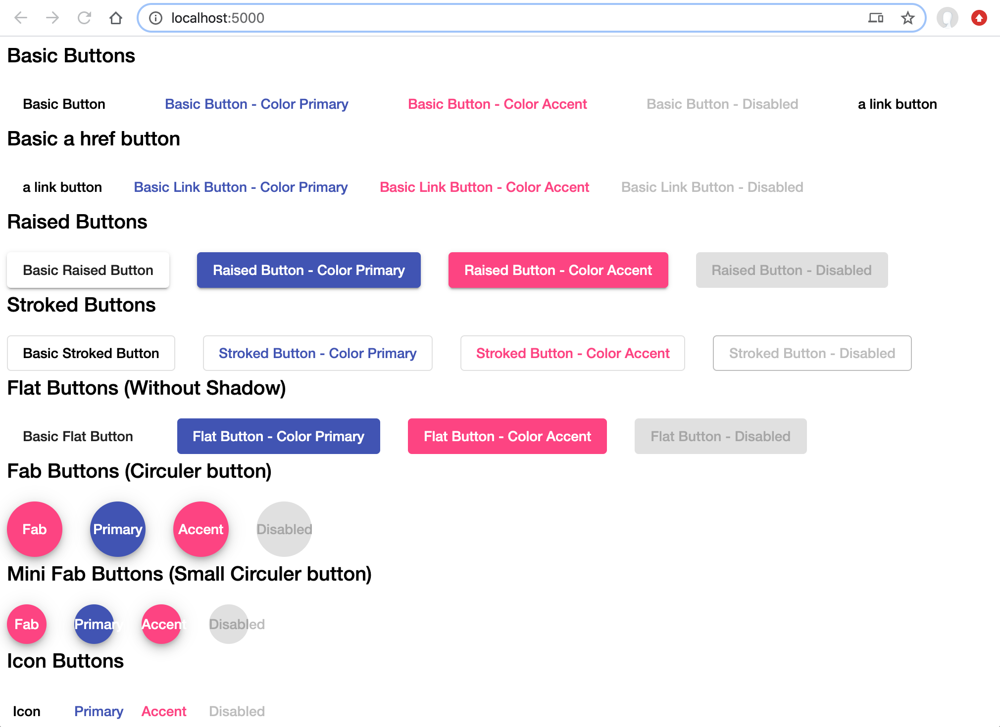

> **Description**:

Let's Learn what is Angular Material. How to start using Angular Material components to build/design/develop clean and elegant UI. Its practical guide for building Angular 7/8 applications with Angular Material.

> **Topics (separate with spaces)**:
Add topics to categorize your repository and make it more discoverable.

- angular-material
- angular-material-7
- angular-material-8
- material-design
- google-material-design
- material-components
- material-icons
- material-theme
- mat-button
- mat-checkbox
- mat-table
- schematics
- mat-sidenav
- mat-checkbox
- mat-radio
- angular-cdk
- material-typography
- material-themes
- angular-material-components
- angular-material-themes

<p align="center">
 
</p>

<p align="center">
 
</p>

Angular Material getting started tutorial
=====================

- Angular Material is a UI component library (Material Design components for Angular)
- Angular Material is a collection of components helps to keep application modern with slim sleek and intuitive look and feel

This tutorial explains the fundamental concepts of Angular Material.

Welcome
---------------------

Hi All, I'm **`Dinanath Jayaswal, Senior UI/Web Developer and Adobe Certified Expert Professional`**, I wanna welcome you to `Angular Material Getting started tutorial`.

Who is this for? Audience
---------------------

This Course/Tutorial is ideal for: 
- Professionals who aim to learn and start with the basics of Angular Material
- Developers looking to get in-depth knowledge on the Angular Material Library
- Students who want to dive deeper into Angular Material 
- Students who want to practice Angular Material

Prerequisites for current course / What you need to know
---------------------

- HTML5
- CSS3
- JavaScript
- Basic understanding of TypeScript/JavaScript
- Basics of Angular

What will learn and cover
---------------------

Welcome to the new tutorial series on Angular Material. 

In this introductory Angular Material module will have a look and learn:
- What is Angular Material?
- How to install and start with Angular Material?
- How to use Angular Material components to build/design/develop clean and elegant UI?
- How to work with various Angular Material components like:
  - Form Controls
  - Icons
  - Dialog boxes
  - Progress bars/spinners 
  - Tooltips
  - and many more Angular Material components
- Using In-built/Pre-built theme
- Creating a custom theme
- Use/Explore Angular Material typography
- Create custom typography

Topics included/covered
=====================

1. [Introduction to Angular Material](#1-introduction-to-angular-material)
    - 1.1. [What is Material Design](#11-what-is-material-design)
    - 1.2. [What is Angular Material](#12-what-is-angular-material)
    - 1.3. [Benefits of Angular Material](#13-benefits-of-angular-material)
    - 1.4. [Features of Angular Material](#14-features-of-angular-material)
    - 1.5. [Difference Between Angular Material and Bootstrap](#15-difference-between-angular-material-and-bootstrap) | [Angular Material vs Bootstrap](#15-angular-material-vs-bootstrap)
    - 1.6. [Various Angular Material Comonents](#16-various-angular-material-comonents)

2. [Getting Started with Angular Material](#2-getting-started-with-angular-material)
    - 2.1. [Installing Angular Material](#21-installing-angular-material) | [Angular Material Environment Setup](#21-angular-material-environment-setup)
        - 2.1.1. [Installation-The manual or the long way](#211-installation-the-manual-or-the-long-way)
        - 2.1.2. [Installation-The short or quick way](#212-installation-the-short-or-quick-way)
    - 2.2. [Using Angular Material in project Application](#22-using-angular-material-in-project-application)
    - 2.3. [Creating a separate material module](#23-creating-a-separate-material-module) | [Isolate extract material module](#23-isolate-extract-material-module)
    - 2.4. [Typography](#24-typography)
    - 2.5. [Button](#25-button)
        - 2.5.1. [Disable Ripple Animation Effect](#251-disable-ripple-animation-effect)

1 Introduction to Angular Material
=====================

1.1. What is Material Design
---------------------

Material Design is a `User Interface design language created by Google in 2014`. It dictates a set of principles and guidelines for creating UIs including motion (animations) and interaction (gestures).

1.2. What is Angular Material
---------------------

- Angular Material is a UI component library for Angular developers (Material Design components for Angular)
- Angular Material is the implementation of Material Design for Angular. It offers a set of components and patterns for navigation, forms, buttons, and layouts
- Angular Material is a library of re-usable and high-quality UI components built with Angular and TypeScript
- The angular Material library provides us with the component to build awesome user interface/look and feel in quick time
- It an implementation of Google's Material Design specification and standards (Just like we have UI frameworks for following famous and popular frameworks):
  - **`ReactJs`** -> MaterialUI
  - **`VueJs`** -> Vuetify
  - **`Angular`** -> Angular Material

| **Framework**                     | **UI Component Library**                  |
| ----------------------------------|-------------------------------------------|
| **`ReactJs`**                     | MaterialUI                                |
| **`VueJs`**                       | Vuetify                                   |
| **`Angular`**                     | Angular Material                          |

> Current major version of Angular and Angular Material is version 7 / 8

1.3. Benefits of Angular Material
---------------------
There are several benefits of using Angular Material components. Angular Material Components are:
- Internationalized (Worldwide user with different languages can use)
- Clean and simple API
- Well testing with Unit and Integration test
- Easily Customizable
- Theme based (various themes available)
- Very fast (minimal performance overhead)
- Well-documented
- Community support
- Constructing attractive, consistent, and functional web pages and web applications 
- Follow/Adhere to modern web design principles like browser portability, device independence, and graceful degradation

1.4. Features of Angular Material 
---------------------

- In-built responsive designing
- Cross-browser compatibility 
- Can be used to create reusable web components
- Includes new versions of common UI controls/components such as buttons, checkboxes, and text fields, etc. 
- Adapted to Material Design concepts/principles
- Includes enhanced/specialized features like cards, toolbar, speed dial, side nav, swipe, and so on

1.5. Difference Between Angular Material and Bootstrap
---------------------
1.5. Angular Material vs Bootstrap
---------------------
In an application, one can use UI library/framework as Angular Material or Bootstrap or maybe both together as per needs and requirements

| **Angular Material**              | **Bootstrap**                             |
| ----------------------------------|-------------------------------------------|
| New in the market(recently develop and introduced)                            | Old UI layout framework                                                                |
| Consists of fewer components as compared to Bootstrap                          | Consists of many useful components                                              |
| Angular Material is specially built for Angular, so it is standard framework/UI library used in all Google applications     | Bootstrap is not specially built for Angular so Bootstrap with Angular has lots of third party dependencies which may break any time |
| Angular Material components are built with Angular/TypeScript/JavaScript| Bootstrap is built/developed with plain JavaScript and jQuery. `Bootstrap UI` library is developed with Angular, and used especially for Angular Development    | 
| Common API, Ease to use and standard look and feel for various components| It have a different layout and different standards of look and feel |
| Good to use but not completely stable, as new component development is in progress | Stable |

1.6. Various Angular Material Comonents
---------------------

> Visit Angular Material library home page: website: https://material.angular.io
  - Various Angular components available: website: https://material.angular.io/components/categories

1. Install and Add Angular Material to an application
2. Check Angular Material typography or any other component
3. **Angular Material comprises a different range of components that implement common interaction patterns according to the Material Design specifications. Here is the list of different Angular Material components and 6 major category:**
    1. Form Controls
        - Autocomplete
        - Check box
        - Datepcker
        - Form Field
        - Input
        - Radio button  
        - Select
        - Slider
        - Slide toggle
    2. Navigation
        - Menu
        - Sidenav
        - Toolbar
    3. Layout
        - Card
        - Grid list
        - List
        - Tabs
        - Tree
    4. Buttons & Indicators
        - Button
        - Icon
        - Progress bar/spinner
    5. Popups & Modals
        - Dialog
        - Tooltip
    6. Data table
        - Paginator
        - Table

- Have a look at some of the examples given for/with each component and try to follow it

2 Getting Started with Angular Material
=====================

2.1. Installing Angular Material
---------------------
2.1. Angular Material Environment Setup
---------------------

To install Angular and Angular Material, we require the following:

- Nodejs
- Npm
- Angular CLI
- Visual Code Editor, or an IDE for writing your code

<hr/>

> Its advisable to follow and keep open updated Angular Material guide/help document while implementing any component in an application: 
  - https://material.angular.io/guide
  - https://material.angular.io/guide/getting-started

<hr/>

> First Check Node/NPM, Angular CLI installed version by using the following command: 
```
ng -v 

or 

ng --version

```

<hr/>

> In this tutorial, we'll see how to add Material Design to Angular project/application  in two different ways: ( There are a different set of Material installation processes for Angular/Angular CLI 4+ versions and Angular 6+)

  1. `The manual or the long way`: Install and add all dependencies by following a bunch of steps manually. This works for Angular 4+ versions

  2. `The short or quick way`: By using the `ng add` command to easily/quickly add Angular Material in one step using Angular Schematics. This method only works with Angular 6+ versions

> Its good to have and use Angular CLI version 7 and above installed on your machine (so if Angular CLI version 6 or lower available, please upgrade to Angular CLI version 7)

2.1.1. Installation-The manual or the long way
---------------------

- **`Step 1`**: Install all `dependencies`
- **`Step 2`**: Include an angular material `theme` in current application `styles.css`
- **`Step 3`**: Provide `animation support` if any, by importing `BrowserAnimationsModule` or `NoopAnimationsModule` in `app.module.ts`
- **`Step 4`**: Verify installation of Angular Material, by `using some Material components` in HTML page of an application
- **`Step 5`**: `Run/Serve the application` to get the final output

<hr/>

> **`Step 1`**: Install all dependencies

1. Create a new project with `angular cli` command-line utility
    ```
      ng new demo-material
    ```
2. Change directory to explore inside
    ```
    cd demo-material
    ```
3. install the `Component Dev Kit (CDK)`
    ```
    npm i --save @angular/cdk
    ```

    - `Component Dev Kit (CDK)` is one of the most important dependencies for angular material
    - Its library allows to create and build awesome components for web
4. install Angular Material
    ```
    npm i --save @angular/material
    ```
5. install Angular Animation
    ```
    npm i --save @angular/animations
    ```
6. install `HammerJS` which provides gesture recognition capabilities (website: hammerjs.github.io)
    ```
    npm i --save hammerjs
    ```

> Single command to install everything ie. above all dependencies at one go: 
    ```
    npm i --save @angular/cdk @angular/material @angular/animations hammerjs
    ```

<hr/>

> **`Step 2`**: Include/import an angular material theme in current application styles.css

1. styles.css
    ```css
    @import "~@angular/material/prebuilt-themes/indigo-pink.css";
    ```

<hr/>

> **`Step 3`**: Provide animation support if any, by importing BrowserAnimationsModule in app.module.ts
1. app.module.ts
    ```ts
    import { BrowserAnimationsModule, NoopAnimationsModule } from '@angular/platform-browser/animations';

    imports: [
      BrowserAnimationsModule, NoopAnimationsModule
    ] 
    ```

<hr/>

> **`Step 4`**: Verify installation of Angular Material, by using some components in the application HTML page

1. app.component.html
    - Delete old markup
    - add Angular Material checkbox component markup as: 
    ```html
    <!-- old markup
        <md-checkbox>I am Interested</md-checkbox> 
    -->

    <mat-checkbox>I am Interested</mat-checkbox>
    ```

2. app.module.ts
    ```ts
    /* old statement
    import { MdCheckboxModule } from '@angular/material' */
    
    import { MatCheckboxModule } from '@angular/material/checkbox';
    
    imports: [
      BrowserAnimationsModule, NoopAnimationsModule,
      
      /* old statement
      MdCheckboxModule */

      MatCheckboxModule
    ]
    ```

<hr/>

> **`Step 5`**: Run/Serve the application to get final output and load in the browser:
1. Start the server or Run/Serve the application command: 
    ```
    ng serve
    ```
2. Open browser and type application server path running at: `localhost:4200`

2.1.2. Installation-The short or quick way
---------------------

1. Create a new angular project/application with the command: 
    ```
    ng new material-demo
    ```
2. Navigate into the newly created project/application folder with the command: 
    ```
    cd material-demo
    ```
3. Install or setup Angular Material with the command: 
    ```
    ng add @angular/material
    ``` 

    - Provide an appropriate option for `theme` - `Indigo-pink`

    - Setup `HammerJs for gesture` recognition - `Yes`

    - Browser animations - `Yes`

4. Once this simple basic environment setup is done for Angular Material we are ready to use Angular Material in our project/application

> Note: `ng add @angular/material` command include required modules/dependencies, themes and make entries/changes in files like `angular.json, package.json, index.html, main.ts, styles.css, app.module.ts` etc.

2.2. Using Angular Material in project Application
---------------------

To use Angular Material in project Application, there are 3 simples steps:

1. `Import` required Angular Material component
2. Add the imported Angular Material component under `imports` array
3. Add necessary `HTML tag/markup` related to Angular Material component in HTML markup file/page

<hr/>

Let's do it practically:

1. `app.module.ts`: import required Angular Material component module in app.module.ts
    ```ts
    /* import { MatButtonModule } from '@angular/material' */
    import { MatButtonModule } from '@angular/material/button'
    ```
2. Add the imported Angular Material component under `imports` array
    ```ts
    imports: [ MatButtonModule ]
    ```
3. `app.component.html`: Add necessary html tag/markup related to Angular Material component in html markup file/page
    ```html
    <button mat-button>Check Me! </button>

    <button mat-raised-button>Click Me! </button>
    ```
4. Run/Serve the angular application with command: 
    ```
    ng serve -o
    ```
5. Load application in browser, type url and check output
    ```
    http://localhost:4200
    ```

<hr/>

> **Syntax & Example**: `package.json`

```json
{
  "name": "demo-material",
  "version": "1.0.0",
  "scripts": {
    "ng": "ng",
    "start": "ng serve",
    "build": "ng build",
    "test": "ng test",
    "lint": "ng lint",
    "e2e": "ng e2e"
  },
  "private": true,
  "dependencies": {
    "@angular/animations": "~7.2.15",
    "@angular/cdk": "^7.3.7",
    "@angular/common": "~7.2.15",
    "@angular/compiler": "~7.2.15",
    "@angular/core": "~7.2.15",
    "@angular/forms": "~7.2.15",
    "@angular/http": "~7.2.15",
    "@angular/material": "~7.3.7",
    "@angular/platform-browser": "~7.2.15",
    "@angular/platform-browser-dynamic": "~7.2.15",
    "@angular/router": "~7.2.15",
    "core-js": "^2.5.4",
    "hammerjs": "~2.0.8",
    "rxjs": "~6.5.2",
    "zone.js": "~0.8.29"
  },
  "devDependencies": {
    "@angular-devkit/build-angular": "~0.6.8",
    "@angular/cli": "~7.3.9",
    "@angular/compiler-cli": "~7.2.15",
    "@angular/language-service": "^6.0.3",
    "@types/jasmine": "~2.8.6",
    "@types/jasminewd2": "~2.0.3",
    "@types/node": "~8.9.4",
    "codelyzer": "~4.2.1",
    "jasmine-core": "~2.99.1",
    "jasmine-spec-reporter": "~4.2.1",
    "karma": "~1.7.1",
    "karma-chrome-launcher": "~2.2.0",
    "karma-coverage-istanbul-reporter": "~2.0.0",
    "karma-jasmine": "~1.1.1",
    "karma-jasmine-html-reporter": "^0.2.2",
    "protractor": "~5.3.0",
    "ts-node": "~5.0.1",
    "tslint": "~5.9.1",
    "typescript": "^3.2.4"
  }
}
```

<hr/>

> **Syntax & Example**: `styles.css`

```css
@import "~@angular/material/prebuilt-themes/indigo-pink.css";

body {
  font-family: Roboto,"Helvetica Neue",sans-serif;
}
```

<hr/>

> **Syntax & Example**: `app.module.ts`

```ts
import { BrowserModule } from '@angular/platform-browser';
import { NgModule } from '@angular/core';

import { AppComponent } from './app.component';

import { BrowserAnimationsModule, NoopAnimationsModule } from '@angular/platform-browser/animations'

import { MatCheckboxModule } from '@angular/material/checkbox';
import { MatButtonModule } from '@angular/material/button'

@NgModule({
  declarations: [
    AppComponent
  ],
  imports: [
    BrowserModule,
    BrowserAnimationsModule,
    NoopAnimationsModule,

    MatCheckboxModule, MatButtonModule
  ],
  providers: [],
  bootstrap: [AppComponent]
})

export class AppModule { }
```

<hr/>

> **Syntax & Example**: `app.component.html`

```html
<div style="text-align:center">
  
  <h1>Welcome to {{ title }}!</h1>

  

</div>

<div>

  <h2>Initial Angular Material Markup for testing: </h2>

  <mat-checkbox>I am Interested</mat-checkbox> <br/> <br/>

  Simple Button: <button mat-button>Check Me! </button> <br/> <br/>

  Raised Button: <button mat-raised-button>Click Me! </button> <br/> <br/>

  <hr/>

</div>

```

<p>
  <figure>
    &nbsp;&nbsp;&nbsp; 
    <figcaption>&nbsp;&nbsp;&nbsp; Image 2.2 - Angular Material installation - initial module/component import - component testing </figcaption>
  </figure>
</p>

2.3. Creating a separate material module
---------------------
2.3. Isolate extract material module
---------------------

- It is advisable/better recommended and professional approach to create a separate Angular material module named `angMaterials` which will contain/deal with importing and exporting all required Angular material component modules. 
- Include the `angMaterials` module in `app.module.ts` so that Angular material components code will be isolated as well as it will neat-clean and readable.
    ```
    `ng g m angMaterials` 

    or 

    `ng generate module angMaterials`
    ```
- `angMaterials.module.ts` file will consist of only the import and exports related to Angular Material modules. So please remove all import and exports statements related to Angular Material modules from `app.module.ts` and add it into newly created `angMaterials.module.ts`:
    ```ts
    /* import { MatButtonModule } from `@angular/material` */
    import { MatButtonModule } from '@angular/material/button'

    const AngMaterialsCompModule = [
        MatButtonModule
    ]

    imports: [ AngMaterialsCompModule ], 
    exports: [ AngMaterialsCompModule ]
    ```  
- Every Angular Material component/module used in the application/project should be enter under `const AngMaterialsCompModule` 
- Finally include/import and imports the `AngMaterialsModule` in app module
- Restart the server and run the application than check in browser

<hr/>

> **Syntax & Example**: `app.module.ts`

```ts
import { BrowserModule } from '@angular/platform-browser';
import { NgModule } from '@angular/core';

import { AppComponent } from './app.component';

import { BrowserAnimationsModule, NoopAnimationsModule } from '@angular/platform-browser/animations'

/* import { MatCheckboxModule } from '@angular/material/checkbox';
import { MatButtonModule } from '@angular/material/button' */
import { AngMaterialsModule } from './ang-materials/ang-materials.module';

@NgModule({
  declarations: [
    AppComponent
  ],
  imports: [
    BrowserModule,
    BrowserAnimationsModule,
    NoopAnimationsModule,
    /* MatCheckboxModule, MatButtonModule */
    AngMaterialsModule

  ],
  providers: [],
  bootstrap: [ AppComponent ]
})

export class AppModule { }
```

<hr/>

> **Syntax & Example**: `ang-materials.module.ts`

```ts
import { NgModule } from '@angular/core';

import { MatCheckboxModule } from '@angular/material/checkbox';
import { MatButtonModule } from '@angular/material/button'

const AngMaterialsCompModule = [
  MatButtonModule,
  MatCheckboxModule
]

@NgModule({
  declarations: [],
  imports: [
    AngMaterialsCompModule
  ],
  exports: [ AngMaterialsCompModule ]

})

export class AngMaterialsModule { }
```

<hr/>

> **Syntax & Example**: `app.component.html`

```html
<!--The content below is only a placeholder and can be replaced.-->
<div style="text-align:center">
  
  <h1>Welcome to {{ title }}!</h1>

  

</div>

<div>

  <h2>Initial Angular Material Markup for testing: Isolated Angular material module</h2>

  <mat-checkbox>I am Interested</mat-checkbox> <br/> <br/>

  Simple Button: <button mat-button>Check Me! </button> <br/> <br/>

  Raised Button: <button mat-raised-button>Click Me! </button> <br/> <br/>

  <hr/>

</div>
```

<p>
  <figure>
    &nbsp;&nbsp;&nbsp; 
    <figcaption>&nbsp;&nbsp;&nbsp; Image 2.3 - Isolated Angular Material - initial module/component import - component testing </figcaption>
  </figure>
</p>

2.4. Typography
---------------------

- Typography is nothing but managing/systematizing/representing the text in distinct/legible, readable, and appealing way when displayed/used on a page
- Angular Material's typography is based on the guidelines from the `Google Material Design spec` and is designed/arranged and systematized into different typography levels
- Typography basically deals with the `styles and appearance` of text on a page
- Angular Material consists of `set of classes concern with style, size look and appearance of font/text`
- Angular material provides Typography levels which keeps the font/text size standardised/definite with `font-face/family`, `font-size`, `font-weight` and `line-height`
- Material Typography classes (`.mat-typography`) mostly starts/prefixed with `mat` keyword. example: `.mat-display-1`, `mat-h1`, `.mat-headline`, `.mat-title`
- Angular material `mat-display-1` to `mat-display-4` classes helps to set Typography heading levels (total 4 display levels - mainly used only once on a page for large headings)
- By default, Angular Material doesn't apply any global CSS, the heading tags like `<h1>` to `<h6>` does not get any material styling. To get proper material styles heading tags we must be wrapped inside `.mat-typography` class. `.mat-typography` the class helps to use various HTML tags normally as this class styles all descendant/child native elements

<hr/>

1. Create a new angular component with angular/cli command:
    ```
    ng generate component typography

    or

    ng g c typography
    ```
2. Write required markup inside `typography.component.html` and include this component in `app.component.html` as tag/element selector `<typography-component></typography-component>`

<hr/>

> **Syntax & Example**: `typography.component.html`

```html
<section>

  <section>
    <span><u>.mat-display-4 to .mat-display-1</u></span> <br/> <br/> 
    <header class="mat-display-4">Header 'mat-display-4'</header>
    <header class="mat-display-3">Header 'mat-display-3'</header>
    <header class="mat-display-2">Header 'mat-display-2'</header>
    <header class="mat-display-1">Header 'mat-display-1'</header>
  </section>

  <hr style="border:1px dashed;" />

  <section>
    <span><u>.mat-display-1 to .mat-display-4 </u></span> <br/> <br/>
    <header class="mat-display-1">Header 'mat-display-1'</header>
    <header class="mat-display-2">Header 'mat-display-2'</header>
    <header class="mat-display-3">Header 'mat-display-3'</header>
    <header class="mat-display-4">Header 'mat-display-4'</header>
  </section>

  <hr style="border:1px dashed;" />

  <section>
    <span><u>.mat-h1 to .mat-h4</u></span> <br/> <br/>
    <header class="mat-h1">Header 'mat-h1'</header>
    <header class="mat-h2">Header 'mat-h2'</header>
    <header class="mat-h3">Header 'mat-h3'</header>
    <header class="mat-h4">Header 'mat-h4'</header>
  </section>

  <hr style="border:1px dashed;" />

  <section class="mat-typography">
    <span><u>.mat-typography -> h1 to h4</u></span> <br/> <br/>
    <h1>'h1 inside mat-typography'</h1>
    <h2>'h2 inside mat-typography'</h2>
    <h3>'h3 inside mat-typography'</h3>
    <h4>'h4 inside mat-typography'</h4>
  </section>

  <hr style="border:1px dashed;" />

  <section>
    <span><u>.mat-headline, .mat-title, .mat-subheading-2</u></span> <br/> <br/>
    <header class="mat-headline">Header 'mat-h1' or 'mat-headline'</header>
    <header class="mat-title">Header 'mat-h2' or 'mat-title'</header>
    <header class="mat-subheading-2">Header 'mat-h3' or 'mat-subheading-2'</header>
    <header class="mat-subheading-1">Header 'mat-h4' or 'mat-subheading-1'</header>
  </section>

  <hr style="border:1px dashed;" />

  <section>
    <span><u>.mat-headline, .mat-title, .mat-subheading-2</u></span> <br/> <br/>
    <header class="mat-body-1">'mat-body-1'</header>
    <header class="mat-body-2">'mat-body-2'</header>
    <header class="mat-body-strong">'mat-body-strong'</header>
    <header class="mat-capton">'mat-small', 'mat-capton'</header>
  </section>

</section>
```

<hr/>

> **Syntax & Example**: `typography.component.html`

```html
<section>
  <span><u>.mat-display-4 to .mat-display-1</u></span> <br/> <br/> 
  <header class="mat-display-4">Header 'mat-display-4'</header>
  <header class="mat-display-3">Header 'mat-display-3'</header>
  <header class="mat-display-2">Header 'mat-display-2'</header>
  <header class="mat-display-1">Header 'mat-display-1'</header>
</section>
```

<p>
  <figure>
    &nbsp;&nbsp;&nbsp; 
    <figcaption>&nbsp;&nbsp;&nbsp; Image 2.4.1 - Angular Material - mat-display classes </figcaption>
  </figure>
</p>

<hr/>

> **Syntax & Example**: `typography.component.html`

```html
<section>
  <span><u>.mat-display-1 to .mat-display-4 </u></span> <br/> <br/>
  <header class="mat-display-1">Header 'mat-display-1'</header>
  <header class="mat-display-2">Header 'mat-display-2'</header>
  <header class="mat-display-3">Header 'mat-display-3'</header>
  <header class="mat-display-4">Header 'mat-display-4'</header>
</section>
```

<p>
  <figure>
    &nbsp;&nbsp;&nbsp; 
    <figcaption>&nbsp;&nbsp;&nbsp; Image 2.4.2 - Angular Material - mat-display classes </figcaption>
  </figure>
</p>

<hr/>

> **Syntax & Example**: `typography.component.html`

```html
<section>
  <span><u>.mat-h1 to .mat-h4</u></span> <br/> <br/>
  <header class="mat-h1">Header 'mat-h1'</header>
  <header class="mat-h2">Header 'mat-h2'</header>
  <header class="mat-h3">Header 'mat-h3'</header>
  <header class="mat-h4">Header 'mat-h4'</header>
</section>

<hr style="border:1px dashed;" />

<section class="mat-typography">
  <span><u>.mat-typography -> h1 to h4</u></span> <br/> <br/>
  <h1>'h1 inside mat-typography'</h1>
  <h2>'h2 inside mat-typography'</h2>
  <h3>'h3 inside mat-typography'</h3>
  <h4>'h4 inside mat-typography'</h4>
</section>

<hr style="border:1px dashed;" />

<section>
  <span><u>.mat-headline, .mat-title, .mat-subheading-2</u></span> <br/> <br/>
  <header class="mat-headline">Header 'mat-h1' or 'mat-headline'</header>
  <header class="mat-title">Header 'mat-h2' or 'mat-title'</header>
  <header class="mat-subheading-2">Header 'mat-h3' or 'mat-subheading-2'</header>
  <header class="mat-subheading-1">Header 'mat-h4' or 'mat-subheading-1'</header>
</section>

<hr style="border:1px dashed;" />

<section>
  <span><u>.mat-headline, .mat-title, .mat-subheading-2</u></span> <br/> <br/>
  <header class="mat-body-1">'mat-body-1'</header>
  <header class="mat-body-2">'mat-body-2'</header>
  <header class="mat-body-strong">'mat-body-strong'</header>
  <header class="mat-capton">'mat-small', 'mat-capton'</header>
</section>
```

<p>
  <figure>
    &nbsp;&nbsp;&nbsp; 
    <figcaption>&nbsp;&nbsp;&nbsp; Image 2.4.3 - Angular Material - mat-h1, mat-typography, mat-headline </figcaption>
  </figure>
</p>

<hr/>

> **`Note`**: 
  - Applying typography related classes to an individual elements is pretty time consuming and tedious, so the best practice/the better and also advisable way is that to apply `mat-typography` class to main parent container/element or at global level (The `.mat-typography` class helps to use various HTML tags normally as this class styles all descendant/child native elements)

> **Syntax & Example**: `typography.component.html`

```html
<section class="mat-typography">
  <h1>h1 inside mat-typography</h1>
  <h2>h2 inside mat-typography</h2>
  <h3>h3 inside mat-typography</h3>
  <h4>h4 inside mat-typography</h4>
  <p>p paragraph inside mat-typography</p>
  <caption>caption inside mat-typography</caption>
</section>
```
<p>
  <figure>
    &nbsp;&nbsp;&nbsp; 
    <figcaption>&nbsp;&nbsp;&nbsp; Image 2.4.4 - Angular Material - Apply .mat-typography class at global/parent level </figcaption>
  </figure>
</p>

2.5. Button
---------------------

- Angular Material buttons are native `<button>` and/or `<a>` tags/elements enhanced with Material Design styling and ink ripples
- `'mat-button'` attribute is used with `<button>` and/or `<a>` tags/elements to get look and feel of Angular Material button

> **Syntax & Example**: `app.component.html`

```html
<buttons-component></buttons-component>
```

> **Syntax & Example**: `buttons.component.html`

```html
<section class="mat-typography">
  
  <h2>Basic Buttons</h2>
  <button mat-button>Basic Button</button>
  <button mat-button color="primary">Basic Button - Color Primary</button>
  <button mat-button color="accent">Basic Button - Color Accent</button>
  <button mat-button disabled>Basic Button - Disabled</button>
  <a mat-button>a link button</a>

  <h2>Basic a href button</h2>
  <a mat-button>a link button</a>
  <a mat-button color="primary">Basic Link Button - Color Primary</a>
  <a mat-button color="accent">Basic Link Button - Color Accent</a>
  <a mat-button disabled>Basic Link Button - Disabled</a>

  <h2>Raised Buttons</h2>
  <button mat-raised-button>Basic Raised Button</button>
  <button mat-raised-button color="primary">Raised Button - Color Primary</button>
  <button mat-raised-button color="accent">Raised Button - Color Accent</button>
  <button mat-raised-button disabled>Raised Button - Disabled</button>

  <h2>Stroked Buttons</h2>
  <button mat-stroked-button>Basic Stroked Button</button>
  <button mat-stroked-button color="primary">Stroked Button - Color Primary</button>
  <button mat-stroked-button color="accent">Stroked Button - Color Accent</button>
  <button mat-stroked-button disabled>Stroked Button - Disabled</button>

  <h2>Flat Buttons (Without Shadow)</h2>
  <button mat-flat-button>Basic Flat Button</button>
  <button mat-flat-button color="primary">Flat Button - Color Primary</button>
  <button mat-flat-button color="accent">Flat Button - Color Accent</button>
  <button mat-flat-button disabled>Flat Button - Disabled</button>

  <h2>Fab Buttons (Circuler button)</h2>
  <button mat-fab>Fab</button>
  <button mat-fab color="primary">Primary</button>
  <button mat-fab color="accent">Accent</button>
  <button mat-fab disabled>Disabled</button>

  <h2>Mini Fab Buttons (Small Circuler button)</h2>
  <button mat-mini-fab>Fab</button>
  <button mat-mini-fab color="primary">Primary</button>
  <button mat-mini-fab color="accent">Accent</button>
  <button mat-mini-fab disabled>Disabled</button>

  <h2>Icon Buttons</h2>
  <button mat-icon-button>Icon</button>
  <button mat-icon-button color="primary">Primary</button>
  <button mat-icon-button color="accent">Accent</button>
  <button mat-icon-button disabled>Disabled</button>

</section>
```

> **Syntax & Example**: `styles.css`

```css
section.mat-typography button {
  margin-right: 2em;
}
```

<p>
  <figure>
    &nbsp;&nbsp;&nbsp; 
    <figcaption>&nbsp;&nbsp;&nbsp; Image 2.5.1 - Angular Material Buttons </figcaption>
  </figure>
</p>

### **2.5.1. Disable Ripple Animation Effect**

- `disableRipple` attribute is used to Disable Ripple Animation Effect of Angular Material Button

> **Syntax & Example**: `buttons.component.html`

```html
<button mat-button disableRipple>Basic Button - Disabled</button>

<button mat-icon-button disableRipple>Disable Ripple</button>
```
